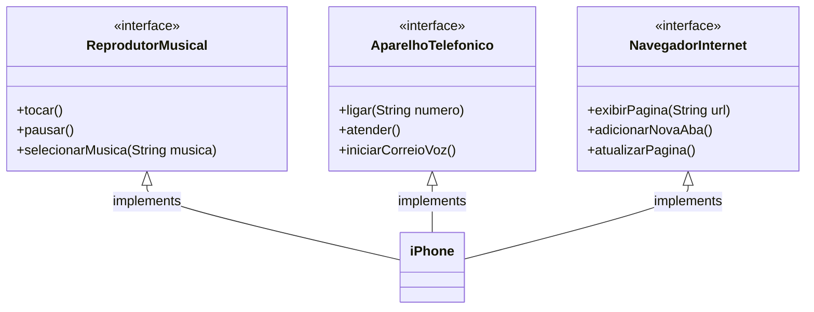

# poo-desafio

Representação UML do componente iPhone, abrangendo suas funcionalidades como Reprodutor Musical, Aparelho Telefônico e Navegador na Internet.

### Diagrama UML (Mermaid)

```mermaid
classDiagram

    class ReprodutorMusical{
        <<interface>>
        +tocar()
        +pausar()
        +selecionarMusica(String musica)
    }

    class AparelhoTelefonico {
        <<interface>>
        +ligar(String numero)
        +atender()
        +iniciarCorreioVoz()
    }

    class NavegadorInternet {
        <<interface>>
        +exibirPagina(String url)
        +adicionarNovaAba()
        +atualizarPagina()
    }

    class iPhone {
    }

    ReprodutorMusical <|-- iPhone : implements 
    AparelhoTelefonico <|-- iPhone : implements 
    NavegadorInternet <|-- iPhone : implements 

```
